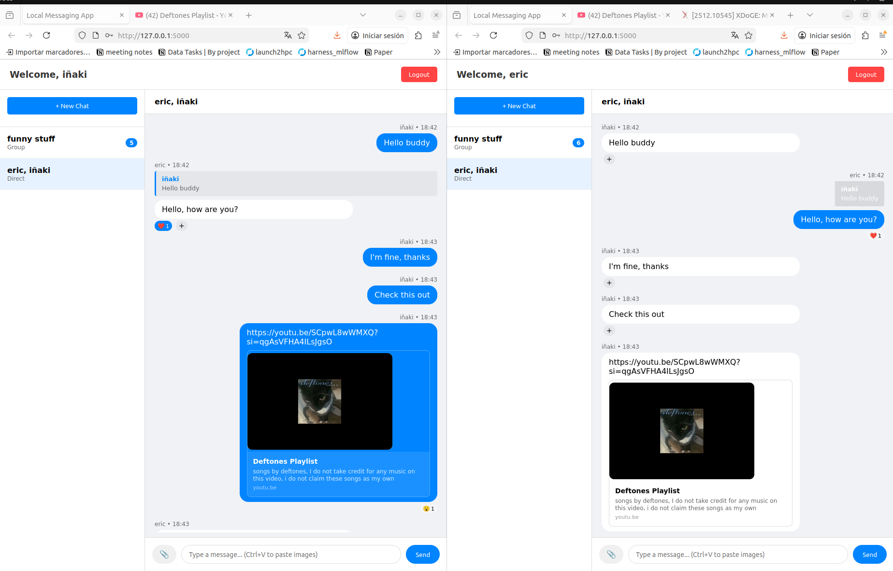
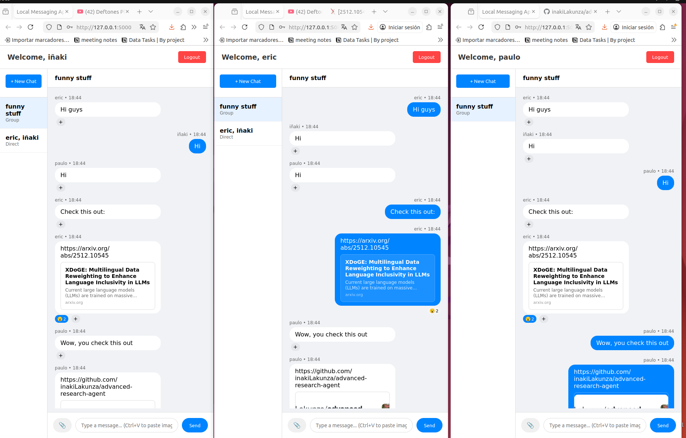
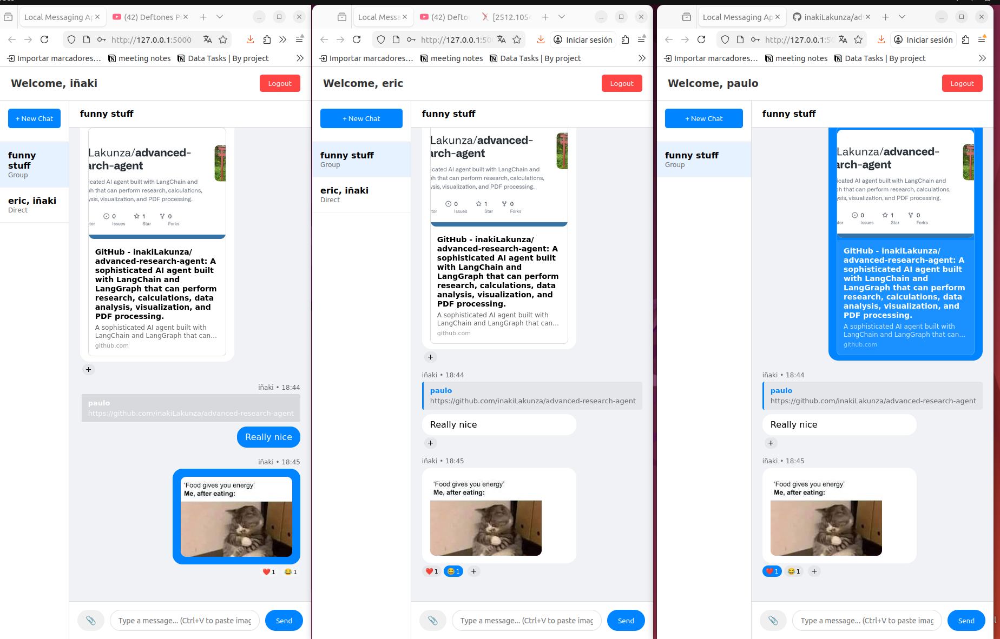

# 💬 Flask Real-Time Messenger: Socket.IO Chat Platform

A robust, full-stack local messaging application built with Flask and Socket.IO. This platform supports real-time communication, rich media sharing, and interactive social features like message reactions and link previews.

## 🚀 Overview

This project serves as a comprehensive communication tool designed for local networks. It bridges the gap between simple chat apps and modern platforms by incorporating advanced features like threaded replies and automatic URL metadata extraction.

---

## ✨ Key Features

- 🔐 **Secure Authentication**: User registration and login with hashed password security.
- 👥 **Versatile Chat Modes**: 
  - **Direct Messaging**: Private one-to-one conversations.
  - **Group Chats**: Multi-user rooms with customizable names.
- ⚡ **Real-Time Interaction**:
  - Instant message delivery via WebSockets.
  - **Typing Indicators**: See when others are composing a message.
  - **Threaded Replies**: Reply to specific messages to keep conversations organized.
- ❤️ **Message Reactions**: Express yourself with emoji reactions on any message.
- 🖼️ **Multimedia Support**: 
  - Upload and view images and videos directly in the chat.
  - Clipboard support: Paste images directly into the input field.
- 🔗 **Smart Link Previews**: Automatic generation of titles, descriptions, and thumbnails for shared URLs.
- 📁 **Local Storage**: Completely self-contained SQLite database—no cloud dependencies required.

---

## 📸 Visual Showcase

### Direct Messaging & Link Previews


### Group Conversations
| Group View - User A | Group View - User B |
|:---:|:---:|
|  |  |

### 🎬 Video Tutorial
A full pipeline demonstration including registration, chat creation, media sharing, and reactions is available here:
**[View Full Tutorial (media/full_tutorial.webm)](media/full_tutorial.webm)**
*(The full pipeline is explained in detail within this walkthrough)*

---

## 🛠️ Tech Stack

- **Backend**: Python 3.x, Flask, Flask-SocketIO (Eventlet)
- **Frontend**: Vanilla JavaScript, Socket.IO Client, CSS3 (Flexbox/Grid)
- **Database**: SQLite
- **Parsing**: BeautifulSoup4, LXML (for Link Previews)

---

## 🚀 Quick Start

### Installation

1. **Clone the repository:**
```bash
git clone [https://github.com/inakiLakunza/real-time-message-app.git](https://github.com/inakiLakunza/real-time-message-app.git)
cd message_app
```

2. **Create and activate a virtual environment:**
```bash
python -m venv venv
source venv/bin/activate  # On Windows: venv\Scripts\activate
```

3. **Install dependencies:**
```bash
pip install -r requirements.txt
```

### Usage

1. **Run the server**
```bash
python app.py
```

2. **Access the App:** Open your browser to http://localhost:5000. To test real-time features, create different windows and logout if already logged in, or create incognito tabs.


## 📁 Repository Structure

```Plaintext
message_app/
├── app.py              # Flask server & Socket.IO logic
├── messaging.db        # SQLite Database (Auto-generated)
├── requirements.txt    # Project dependencies
├── media/              # Documentation assets (Screenshots/Video)
├── static/             # Frontend logic (app.js) and styles
├── templates/          # UI Layout (index.html)
├── uploads/            # User-uploaded media files
└── venv/               # Python virtual environment
```

## 🔧 Configuration & Network Access

To allow other devices on your Local Area Network (LAN) to join the chat:

1. Identify your local IP (e.g., 192.168.1.XX).

2. Have participants navigate to http://192.168.1.XX:5000 in their browsers.


## 📝 License

This project is licensed under the MIT License - see the LICENSE file for details.

## 📧 Contact

**Iñaki Lacunza** - Deep Learning Research Engineer at [Barcelona Supercomputing Center](https://www.bsc.es/)

- [LinkedIn](https://www.linkedin.com/in/inaki-lacunza-castilla/)
- [Google Scholar](https://scholar.google.com/citations?user=e7huPQcAAAAJ&hl=es)
- [GitHub](https://github.com/inakiLakunza)
- [Barcelona Supercomputing Center](https://www.bsc.es/es/lacunza-castilla-inaki)

CV available in LinkedIn

**Project Link:** [https://github.com/inakiLakunza/real-time-message-app](https://github.com/inakiLakunza/real-time-message-app)

---

⭐ If you find this project useful, please consider giving it a star!
